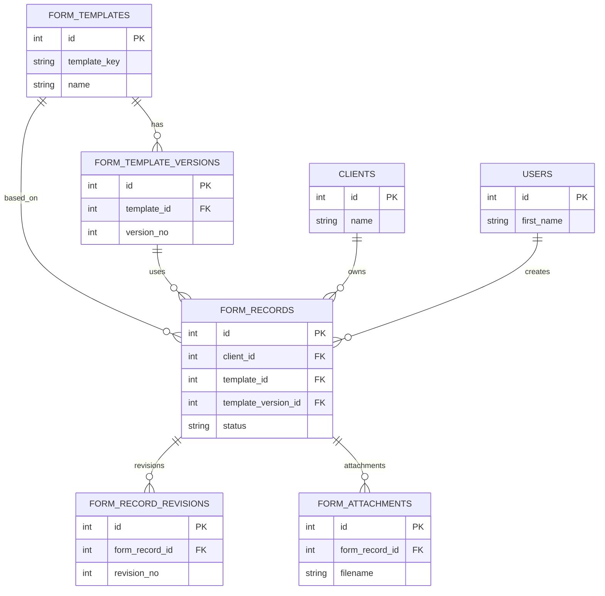

```mermaid
erDiagram

    FORM_TEMPLATES {
        int id PK
        string template_key
        string name
    }

    FORM_TEMPLATE_VERSIONS {
        int id PK
        int template_id FK
        int version_no
    }

    FORM_RECORDS {
        int id PK
        int client_id FK
        int template_id FK
        int template_version_id FK
        string status
    }

    FORM_RECORD_REVISIONS {
        int id PK
        int form_record_id FK
        int revision_no
    }

    FORM_ATTACHMENTS {
        int id PK
        int form_record_id FK
        string filename
    }

    CLIENTS {
        int id PK
        string name
    }

    USERS {
        int id PK
        string first_name
    }

    FORM_TEMPLATES ||--o{ FORM_TEMPLATE_VERSIONS : has

    FORM_TEMPLATES ||--o{ FORM_RECORDS : based_on

    FORM_TEMPLATE_VERSIONS ||--o{ FORM_RECORDS : uses

    CLIENTS ||--o{ FORM_RECORDS : owns

    USERS ||--o{ FORM_RECORDS : creates

    FORM_RECORDS ||--o{ FORM_RECORD_REVISIONS : revisions

    FORM_RECORDS ||--o{ FORM_ATTACHMENTS : attachments
```