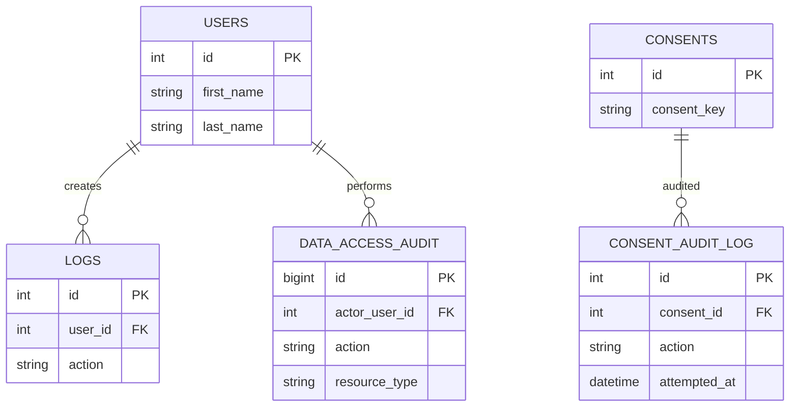

```mermaid
erDiagram

    USERS {
        int id PK
        string first_name
        string last_name
    }

    LOGS {
        int id PK
        int user_id FK
        string action
    }

    DATA_ACCESS_AUDIT {
        bigint id PK
        int actor_user_id FK
        string action
        string resource_type
    }

    CONSENTS {
        int id PK
        string consent_key
    }

    CONSENT_AUDIT_LOG {
        int id PK
        int consent_id FK
        string action
        datetime attempted_at
    }

    USERS ||--o{ LOGS : creates

    USERS ||--o{ DATA_ACCESS_AUDIT : performs

    CONSENTS ||--o{ CONSENT_AUDIT_LOG : audited
```