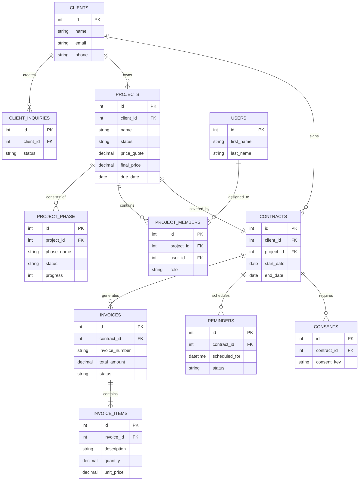

```mermaid
erDiagram

    CLIENTS {
        int id PK
        string name
        string email
        string phone
    }

    CLIENT_INQUIRIES {
        int id PK
        int client_id FK
        string status
    }

    PROJECTS {
        int id PK
        int client_id FK
        string name
        string status
        decimal price_quote
        decimal final_price
        date due_date
    }

    PROJECT_PHASE {
        int id PK
        int project_id FK
        string phase_name
        string status
        int progress
    }

    PROJECT_MEMBERS {
        int id PK
        int project_id FK
        int user_id FK
        string role
    }

    USERS {
        int id PK
        string first_name
        string last_name
    }

    CONTRACTS {
        int id PK
        int client_id FK
        int project_id FK
        date start_date
        date end_date
    }

    INVOICES {
        int id PK
        int contract_id FK
        string invoice_number
        decimal total_amount
        string status
    }

    INVOICE_ITEMS {
        int id PK
        int invoice_id FK
        string description
        decimal quantity
        decimal unit_price
    }

    REMINDERS {
        int id PK
        int contract_id FK
        datetime scheduled_for
        string status
    }

    CONSENTS {
        int id PK
        int contract_id FK
        string consent_key
    }

    CLIENTS ||--o{ CLIENT_INQUIRIES : creates
    CLIENTS ||--o{ PROJECTS : owns

    PROJECTS ||--o{ PROJECT_PHASE : consists_of
    PROJECTS ||--o{ PROJECT_MEMBERS : contains
    USERS ||--o{ PROJECT_MEMBERS : assigned_to

    CLIENTS ||--o{ CONTRACTS : signs
    PROJECTS ||--|| CONTRACTS : covered_by

    CONTRACTS ||--o{ INVOICES : generates
    INVOICES ||--|{ INVOICE_ITEMS : contains

    CONTRACTS ||--o{ REMINDERS : schedules
    CONTRACTS ||--o{ CONSENTS : requires
```