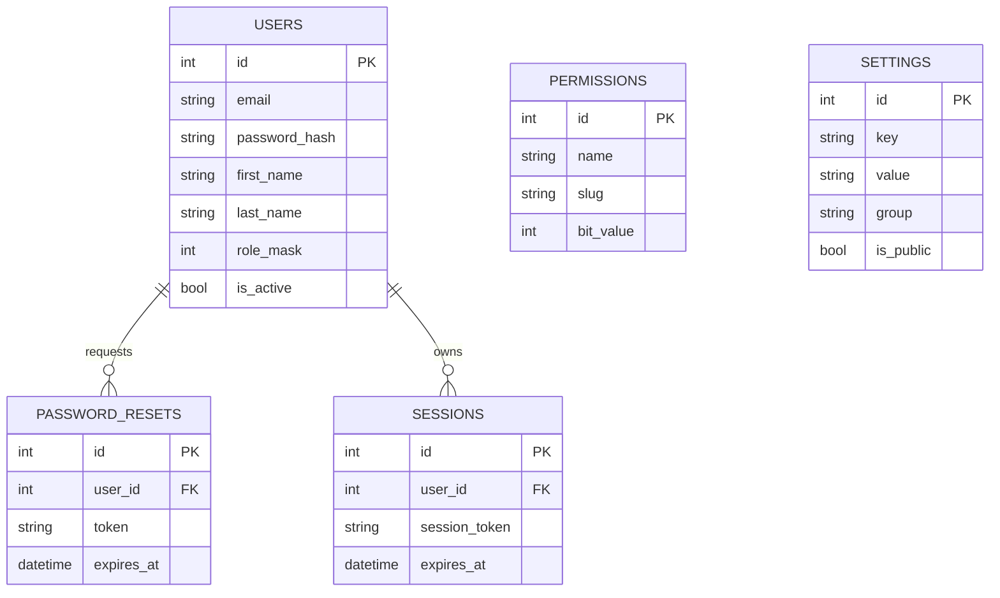

```mermaid
erDiagram

    USERS {
        int id PK
        string email
        string password_hash
        string first_name
        string last_name
        int role_mask
        bool is_active
    }

    PERMISSIONS {
        int id PK
        string name
        string slug
        int bit_value
    }

    SETTINGS {
        int id PK
        string key
        string value
        string group
        bool is_public
    }

    PASSWORD_RESETS {
        int id PK
        int user_id FK
        string token
        datetime expires_at
    }

    SESSIONS {
        int id PK
        int user_id FK
        string session_token
        datetime expires_at
    }

    USERS ||--o{ PASSWORD_RESETS : requests
    USERS ||--o{ SESSIONS : owns
```