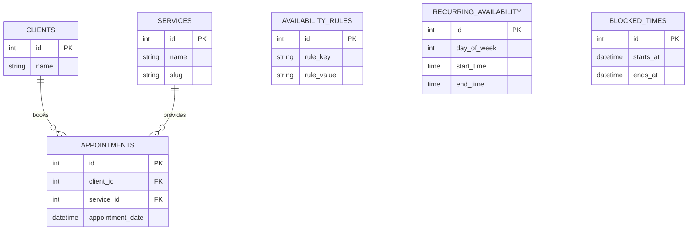

```mermaid
erDiagram

    CLIENTS {
        int id PK
        string name
    }

    SERVICES {
        int id PK
        string name
        string slug
    }

    APPOINTMENTS {
        int id PK
        int client_id FK
        int service_id FK
        datetime appointment_date
    }

    AVAILABILITY_RULES {
        int id PK
        string rule_key
        string rule_value
    }

    RECURRING_AVAILABILITY {
        int id PK
        int day_of_week
        time start_time
        time end_time
    }

    BLOCKED_TIMES {
        int id PK
        datetime starts_at
        datetime ends_at
    }

    CLIENTS ||--o{ APPOINTMENTS : books

    SERVICES ||--o{ APPOINTMENTS : provides
```